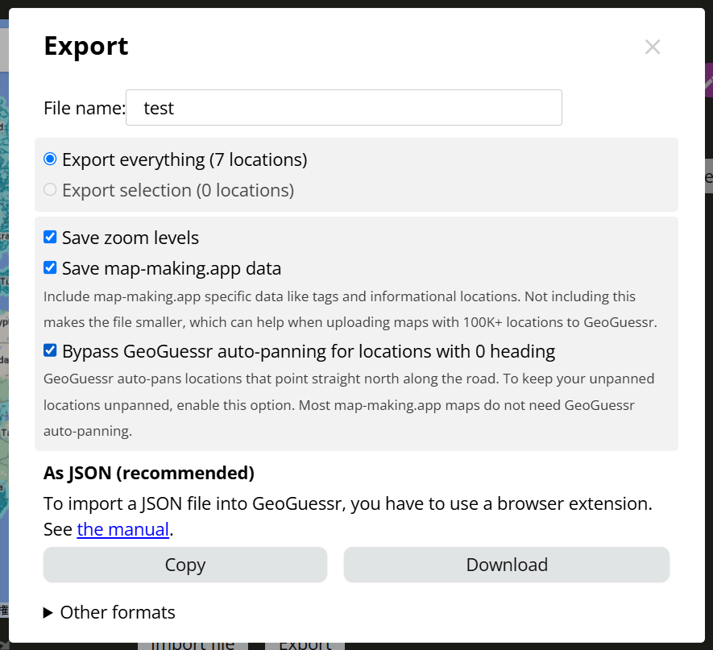

## このリポジトリ
GeoGuessr と map-making-app のインポート/エクスポートのファイル形式の変換プログラム

## インポート/エクスポート
### GeoGuessr
マップ作製ページ[1]の画面右上の「...」から「INPORT JSON FILE」もしくは「EXPORT JSON FILE」
- [1] https://www.geoguessr.com/map-maker/XXX
### map-making-app
マップ作成ページ[2]で画面下中央の「EXPORT」から以下の画像の通りに設定して「Download」
- [2] https://map-making.app/maps/XXX
- 
- 「Save map-making-app data」にチェックを付けるとタグの情報などを含むが，GeoGuessrで読み込むときは無視される

## ファイル形式の仕様
基本map-making-appのエクスポート形式に合わせる
- なぜなら，**map-making-appのエクスポート形式は，map-making-appとGeoGeessrの両方でインポート可能**のため

### JSON構造と情報
GeoGuessrにインポートするJSONファイルには，以下のJSON構造とアトリビュートが要求される
- 下記以外のアトリビュート（たとえば"extra"）は無視される
- アトリビュートの順番は関係ない
- JSONは括弧の種類（`[]`や`{}`）が違うと正しく認識しない場合があるため注意が必要
```
[
    {
        "lat": 52.56592672365785,
        "lng": 17.99465991237902,
        "heading": 143.03026350739583,
        "pitch": 1.929415613713772,
        "zoom": 0.16992431383057116,
        "panoId": null,
    },
    {
        "lat": 18.354966066590965,
        "lng": 76.8579272817489,
        "heading": 236.1437,
        "pitch": 0,
        "zoom": 0,
        "panoId": null,
    }
]
```

> [!NOTE]
> とりあえず上記のJSON形式にすればOK  
> タグなどのアトリビュートも追加予定


### map-making-appのJSON
map-making-appでデータをJSONでエクスポートすると以下のようなJSONが得られる
- このままだとGeoGuessr側でインポートできないため，上の形式に変換する必要がある
- この変換のプログラムを開発することが，このリポジトリの目的

```
{
    "name": "test",
    "customCoordinates": [
        {
            "lat": 52.56592672365785,
            "lng": 17.99465991237902,
            "heading": 143.03026350739583,
            "pitch": 1.929415613713772,
            "zoom": 0.16992431383057116,
            "panoId": null,
            "countryCode": null,
            "stateCode": null,
            "extra": {
                "tags": [
                    "a1"
                ],
                "panoId": "MH3vmWH8YoiJCYQzTOQMMA",
                "panoDate": "2012-07"
            }
        },
        {
            "lat": 18.354966066590965,
            "lng": 76.8579272817489,
            "heading": 236.1437,
            "pitch": 0,
            "zoom": 0,
            "panoId": null,
            "countryCode": null,
            "stateCode": null,
            "extra": {
                "tags": [],
                "panoId": "YukGKVeHvpvWn6Ikm3Eh5w",
                "panoDate": "2024-04"
            }
        }
    ]
}
```


